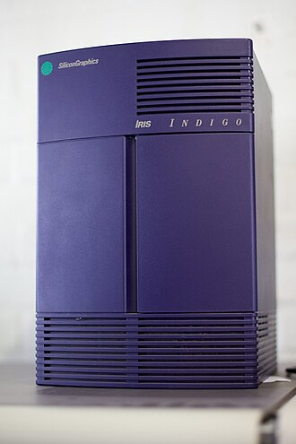

# ip12emu

A fast C++ emulator for the **original SGI Indigo** — the 1991 MIPS R3000A workstation
(board Intel-codenamed **IP12 / "Hollywood"**).

> **Mission: speed, not accuracy.** ip12emu is deliberately *not* a cycle-accurate recreation.
> The goal is to run the Indigo — its PROM, ARCS, IRIX 4.0.x, and NetBSD/sgimips — **as fast as
> possible**, using every optimization available including a JIT for the MIPS core.

## What it emulates

| Component | Hardware |
|---|---|
| CPU | MIPS R3000A @ 33 MHz (MIPS I, 32-bit, big-endian) + optional R3010 FPU |
| Memory | Up to 96 MB |
| Audio | Motorola **DSP56001**, 4-channel 16-bit |
| Ethernet | **Seeq 80C03**, DMA via HPC |
| SCSI | **WD33C93** (SCSI-1) |
| System/DMA | **HPC1** chip — DMA engine for SCSI, Ethernet, etc. |
| Bus | **GIO32** graphics bus, provided/arbitrated by the **PIC** chip (also CPU control, refresh, graphics DMA) |
| Serial | Z8530 (console) |
| Firmware | SGI IP12 PROM (ARCS), SGI part 070-8088-001 / -002 |

## Status

**Phase 1 — Documentation** (in progress).

The project is deliberately staged:

1. **Phase 1 · Documentation** — datasheets, memory maps, register dumps, and reverse-engineering notes in `docs/`.
2. **Phase 2 · The Emulator** — R3000A core, memory, devices, JIT, PROM boot → ARCS → OS milestones.
3. **Phase 3 · Performance & polish** — JIT tuning, threading, save states, UI, packaging.

See [`ROADMAP.md`](ROADMAP.md) for the detailed tracker.

## Repository layout

```
docs/            All documentation: per-chip folders, opcodes, references (datasheets, NetBSD sources)
samples/         Local reference trees (NetBSD, Linux, GXemul) + IP12 PROM dumps — NOT distributed
AGENTS.md        Guidelines for AI agents (project rules, conventions, gotchas)
ROADMAP.md       Phase progress tracker
```

> **Note:** `samples/` contains copyrighted SGI PROM firmware and third-party kernel sources.
> It is gitignored and is **not** part of any release. The emulator itself (once built) loads
> PROM images you provide — it does not ship one.

## Build

No buildable code yet — we are in Phase 1 (documentation). The Phase 2 build will be a single
self-contained CMake/C++20 project with no external dependencies.

## Reference material

The documentation is sourced from:

- **NetBSD/sgimips** — the definitive IP12 reference (HPC, PIC, WD33C93, Seeq, clock, boot code)
- **Linux sgi-ip22** — sibling-era drivers (Seeq 80C03 `sgiseeq`, WD33C93, Z8530, GIO)
- **GXemul** — experimental IP12 machine + ARCS PROM emulation
- Real datasheets (Seeq 80C03, etc.) in `docs/references/pdf-md/`
- Local IP12 PROM dumps for firmware reverse-engineering

## License

Not yet decided. The repository code is intended to be open source; the bundled reference
material in `samples/` and `docs/references/` retains its own licenses/copyrights and is
kept out of public distribution.

---

*The Indigo, "the computer that changed the world" (SGI marketing, 1991). We aim to make it run on your 2020s CPU instead of the R3000.*